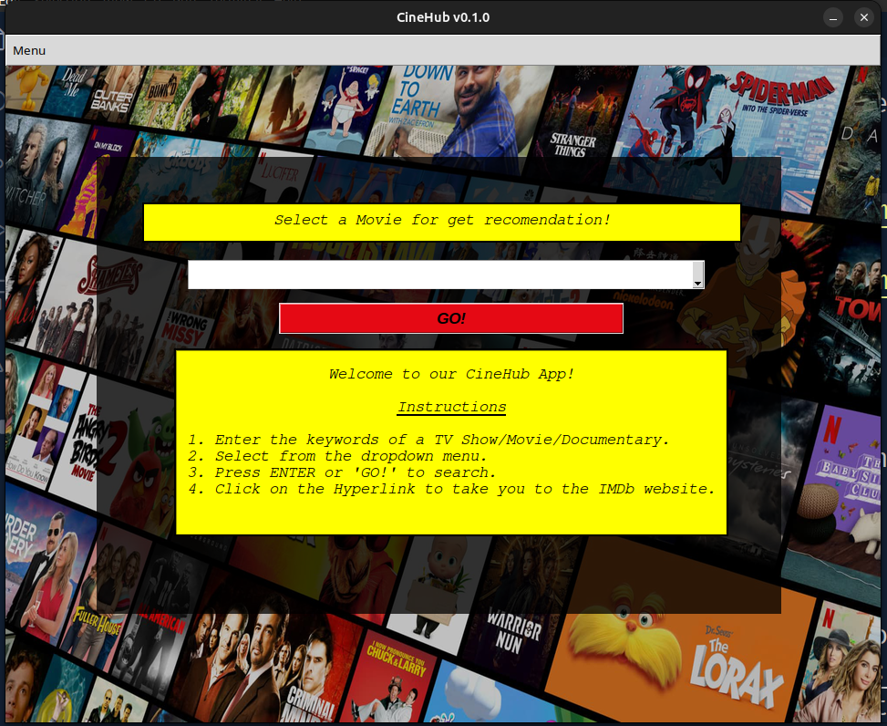
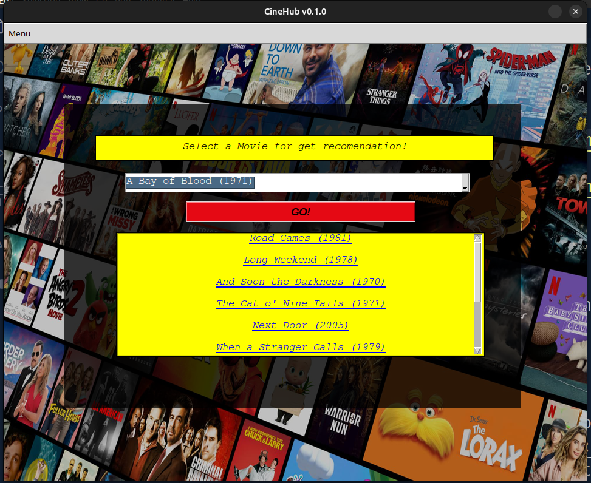

<h1> CineHub - Movie Recommendation App </h1>

Welcome to <b>CineHub</b>, where movie magic meets personalized recommendations! 🌟

<b>CineHub</b> is a cutting-edge movie recommendation app developed for the <b> University Software Development Project II. </b> Dive into a world of cinematic delight as CineHub utilizes advanced algorithms to suggest films tailored to your unique tastes.

<h3>Key Features:</h3>

 <b> 1. Smart Recommendations: </b> Our intelligent recommendation engine analyzes your viewing history and preferences to suggest movies you're sure to love.  
<b> 2. User-Friendly Interface: </b>  Enjoy a sleek and intuitive design that makes navigating through movie options a breeze.  
<b> 3. Search and Discover: </b> Explore a vast database of films, filter by genres, ratings, and more. Find your next favorite movie effortlessly. 

<b> Screenshots: </b>

  </img> 

  </img> 

<b> Installation: </b>

 <b> NOTE: Python 3.8.2 or higher required </b> 

 <b> Windows: </b> 

<ol> 

<li> Clone or download the repository:
    
 <code> git clone https://github.com/mahfuz1703/CineHub.git </code> 

    
 or download the <a href="https://github.com/mahfuz1703/CineHub/archive/refs/heads/main.zip"> zip </a> 

</li>

<li> Open command prompt and create a virtual environment (recommended):
    
 <code> pip install virutalenv </code>

    
 <code> virtualenv myenv </code> 

    
 <code> myenv\Scripts\activate.bat  </code>

</li>

<li> Install the requirements:

 <code> pip install -r requirements.txt </code> 

<li> Run the application:

 <code> python3 main.py </code> 

<li> Done! </li>

</ol>

<!-- 
 Alternatively, Windows users can simply download and run the executable from here: <a href=""> Download </a> 
 -->

<b> Ubuntu: </b>

<ol>
    <li> Clone or download the repository:
        
 <code> git clone https://github.com/mahfuz1703/CineHub.git </code> 

        
 or download the <a href="https://github.com/mahfuz1703/CineHub/archive/refs/heads/main.zip"> zip </a> 

    </li>
    <li> Open a terminal and create a virtual environment (recommended):
        
 <code> pip install virutalenv </code>

        
 <code> virtualenv myenv </code> 

        
 <code> source myenv/bin/activate  </code>

    </li>
    <li> Install Pygame dependencies
        
 <code> sudo apt-get install git python3-dev python3-numpy \
            libsdl-image1.2-dev libsdl-mixer1.2-dev libsdl-ttf2.0-dev libsmpeg-dev \
            libsdl1.2-dev  libportmidi-dev libswscale-dev libavformat-dev libavcodec-dev libfreetype6-dev </code>
    
    </li> 
    <li> Install the requirements:
        
 <code> pip install -r requirements.txt </code> 

        
 or (depends on how python3 is installed) 

        
 <code> pip3 install -r requirements.txt </code>

    </li>
    <li> Run the application:
        
 <code> python main.py </code> 

        
 or (depends on how python3 is installed)

        
 <code> python3 main.py </code>  

    </li>
    <li> 
        Done! Thank you!!!
     </li>
</ol>
